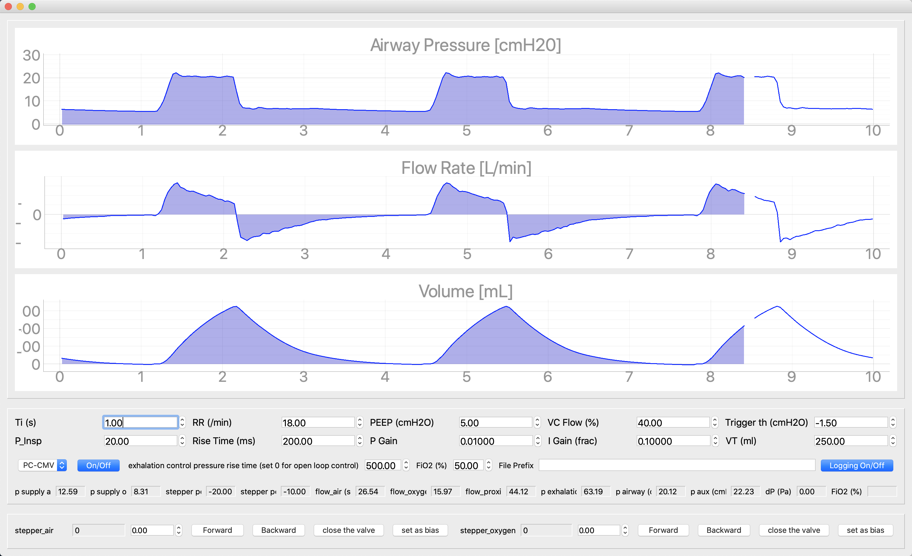

This repo hosts the codes and files for V0 prototype of the Pufferfish ventilator. While V1 uses STM32 and Raspberry Pi 4, in this version Arduino Due and Jetson Nano are used. The software is for development purposes and supports logging sensor readings and other variables at 667 Hz (limited by the 1.5 ms cycle for reading all 8 I2C sensors currently in use). 

To program the Arduino Due
- you need to make sure you have Arduino Due support in your IDE - follow instructions on https://www.arduino.cc/en/Guide/ArduinoDue
- you need to add the libraries in the arduino libraries folder - follow instructions on https://www.arduino.cc/en/guide/libraries 
- make sure you use the native USB port (for both programming and running the Arduino): https://www.arduino.cc/en/uploads/Guide/DueSerialPorts.jpg 

To use the software
- make sure you have installed pyserial, qtpy, pyqt5, pyqtgraph (you can install these packages with pip3 install. E.g. pip3 install qtpy --user)
- use "sudo usermod -aG $USER dialout" to have access to serial ports without sudo
- use "python3 main.py to launch the program"

Notion page for more technical details including setting up the hardware: https://www.notion.so/pufferfish/Pez-Globo-2bedf862f80645cc90a4c7d114437cf6 
